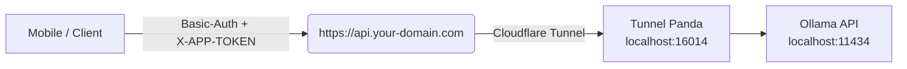

## 🔧 Prerequisites

- **Cloudflare** account & a custom domain you control  
- **Ollama** running locally (`curl http://localhost:11434/v1/health`)

### Install Dependencies

#### Linux (Debian/Ubuntu)
```bash
# cloudflared
curl -L https://github.com/cloudflare/cloudflared/releases/latest/download/cloudflared-linux-amd64.deb -o cloudflared.deb
sudo dpkg -i cloudflared.deb
# Node.js & npm via NodeSource
curl -fsSL https://deb.nodesource.com/setup_18.x | sudo -E bash -
sudo apt-get install -y nodejs
```

#### Linux (RHEL/CentOS/Fedora)
```bash
# cloudflared
curl -L https://github.com/cloudflare/cloudflared/releases/latest/download/cloudflared-linux-amd64.rpm -o cloudflared.rpm
sudo rpm -i cloudflared.rpm
# Node.js & npm via NodeSource
curl -fsSL https://rpm.nodesource.com/setup_18.x | sudo bash -
sudo yum install -y nodejs
```

#### macOS
```bash
# cloudflared
brew install cloudflare/cloudflare/cloudflared
# Node.js & npm via Homebrew
brew install node@18
```

#### Windows (PowerShell Admin)
```powershell
# cloudflared via MSI
Invoke-WebRequest -Uri https://github.com/cloudflare/cloudflared/releases/latest/download/cloudflared-windows-amd64.msi -OutFile cloudflared.msi
Start-Process msiexec.exe -ArgumentList '/i cloudflared.msi /quiet' -Wait
# Node.js & npm via Chocolatey
choco install nodejs-lts -y
```

#### Cross‑platform (npm utilities)
```bash
# concurrently (installed as project dep), dotenv, express, etc. are installed via npm install in project root.
```

---

# 🐼 Tunnel Panda — “Panda lives on 16014”

**Tunnel Panda** is a tiny Node.js reverse‑proxy that listens on **localhost:16014**, secures your local Ollama API behind Basic Auth and a static `X-APP-TOKEN`, and exposes it publicly through **your own Cloudflare Tunnel**.



---

## 📂 Folder Layout

```
tunnelpanda/
├── cloudflared/         # Cloudflare Tunnel config
│   └── config.yml
├── src/                 # Source code
│   ├── app.js           # Tunnel Panda proxy (port 16014)
│   ├── config.js        # Env loader
│   └── setup.js         # Interactive setup script
├── .env.example         # Copy → .env and edit
├── package.json         # Scripts & dependencies
├── start                # Executable launcher script
└── ReadMe.md            # This file
```

---

## 🔧 Prerequisites

- **Cloudflare** account & a custom domain you control  
- `cloudflared` installed on your server  
- **Node.js 18+** and **npm**  
- **Ollama** running locally (e.g. `curl http://localhost:11434/v1/health`)

---

## 🚀 Quick Start

```bash
git clone https://github.com/hidim/tunnelpanda.git
cd tunnelpanda
npm install
npm run setup
```

The **setup assistant** will:

1. Prompt you for Basic Auth credentials, app token and Ollama API settings  
2. Write a verified `.env` file  
3. Log you into Cloudflare (if needed)  
4. Create or reuse the tunnel named `tunnelpanda`  
5. Generate `cloudflared/config.yml`  
6. Create or update the DNS record

---

## ▶️ Running Tunnel Panda

After setup, simply launch both tunnel and proxy together with:

```bash
npm start
```

_or_ via the provided launcher:

```bash
./start
```

This runs:

- `cloudflared tunnel --config cloudflared/config.yml run tunnelpanda`  
- `node src/app.js`

---

## 🛠️ Available Endpoints

All requests require **Basic Auth** plus header `X-APP-TOKEN: <your-token>`.

### Chat Completions

```http
POST /v1/chat/completions
Content-Type: application/json

{
  "model": "phi4:latest",
  "messages": [{"role":"user","content":"Hello Panda"}],
  "stream": false
}
```

### Embeddings

```http
POST /v1/embeddings
Content-Type: application/json

{
  "model": "phi4:latest",
  "input": ["Text to embed"]
}
```

### Models List & Details

```http
GET /v1/models
GET /v1/models/:model
```

### Health Check

```http
GET /v1/health
```

---

## ⚙️ Environment Variables

The setup script writes `.env` with these defaults—you can customize as needed:

```dotenv
PORT=16014
BASIC_AUTH_USER=panda
BASIC_AUTH_PASS=bamboo
APP_TOKEN=super-secret-token

OLLAMA_API_URL=http://localhost:11434
OLLAMA_API_KEY=        # leave empty if Ollama is open
```

---

## 📦 systemd Service (Linux)

Create `/etc/systemd/system/tunnelpanda.service`:

```ini
[Unit]
Description=🐼 Tunnel Panda Proxy
After=network.target

[Service]
WorkingDirectory=/opt/tunnelpanda
ExecStart=/usr/bin/node src/app.js
EnvironmentFile=/opt/tunnelpanda/.env
Restart=always
RestartSec=5

[Install]
WantedBy=multi-user.target
```

```bash
sudo systemctl daemon-reload
sudo systemctl enable --now tunnelpanda
```

---

## 🔒 Security Checklist

- **HTTPS only** — Cloudflare terminates TLS  
- **Rotate** `BASIC_AUTH_PASS` regularly  
- Store `APP_TOKEN` securely (Keychain/Keystore)  
- Adjust rate‑limits in `src/app.js` (default 200 req/min/IP)  
- Monitor logs:  
  - `npm run logs` (if implemented)  
  - Cloudflare Tunnel metrics (`--metrics`)

---

## 📄 License

MIT — Built with ☕, bamboo and Pandas.
# 🐼 Tunnel Panda — “Panda lives on 16014”

Tunnel Panda is a lightweight, secure, and modular Node.js reverse-proxy that exposes your local Ollama API behind a Cloudflare Tunnel. It adds Basic Auth and static token-based security, and streams AI responses via HTTP and WebSocket.

---

## ✨ Features

- 🔐 Basic Authentication + `X-APP-TOKEN` protection
- ☁️ Public Cloudflare Tunnel from your local Ollama
- 🔄 Stream responses over WebSocket
- 📦 Modular route, auth, and logger architecture
- 🧰 Interactive setup assistant (`npm run setup`)
- 📊 Internal rate-limit monitor `/​_internal/rate-status`
- 📜 Winston-based JSON logging with daily rotation
- 🧠 Ollama proxy support: completions, embeddings, models
- 🔁 Self-update via `npm run update`

---

## 📁 Folder Layout

```
tunnelpanda/
├── cloudflared/         # Cloudflare Tunnel config
│   └── config.yml
├── src/
│   ├── app.js           # Main app entry (Express + WS)
│   ├── config.js        # Environment loader
│   ├── setup.js         # Interactive installer
│   ├── routes/          # Modular route handlers
│   │   ├── ollama.js
│   │   └── health.js
│   ├── middleware/
│   │   └── auth.js      # Auth middleware
│   └── utils/
│       └── logger.js    # Winston logger
├── .env.example
├── package.json
├── start
└── README.md
```

---

## 🔧 Prerequisites

- A **Cloudflare** account and domain
- `cloudflared` installed on your system
- **Node.js 18+**
- Ollama running locally on `http://localhost:11434`

---

## 🚀 Quick Start

```bash
git clone https://github.com/hidim/tunnelpanda.git
cd tunnelpanda
npm install
npm run setup
```

Setup will:

1. Prompt for your auth and API settings  
2. Write `.env` and `cloudflared/config.yml`  
3. Log in to Cloudflare and create a DNS tunnel  
4. Guide you to start manually

---

## ▶️ Start the Proxy

```bash
# Start tunnel
cloudflared tunnel --config cloudflared/config.yml run tunnelpanda

# Start proxy server
npm start
```

---

## 🔌 API Endpoints

All endpoints require **Basic Auth** and `X-APP-TOKEN` header.

### Chat Completion
```
POST /api/generate
```

### Embeddings
```
POST /v1/embeddings
```

### Models
```
GET /v1/models
GET /v1/models/:model
```

### Health
```
GET /v1/health
GET /status
```

### WebSocket Streaming
```
WS /v1/chat/stream → streams to /api/generate
```

---

## ⚙️ Environment Variables

`.env` file structure:

```dotenv
PORT=16014
BASIC_AUTH_USER=panda
BASIC_AUTH_PASS=bamboo
APP_TOKEN=super-secret-token

OLLAMA_API_URL=http://localhost:11434
OLLAMA_API_KEY=
```

---

## 🛠️ Update Script

Update app via:

```bash
npm run update
```

This performs:

- `git pull`
- `npm install`

---

## 📦 systemd Example

Linux system service:

```ini
[Unit]
Description=Tunnel Panda
After=network.target

[Service]
WorkingDirectory=/opt/tunnelpanda
ExecStart=/usr/bin/node src/app.js
EnvironmentFile=/opt/tunnelpanda/.env
Restart=always
RestartSec=5

[Install]
WantedBy=multi-user.target
```

```bash
sudo systemctl daemon-reload
sudo systemctl enable --now tunnelpanda
```

---

## 🧪 Internal Monitoring

```http
GET /_internal/rate-status
```

Returns request stats by IP.

---

## 📄 License

MIT — Built with ☕, bamboo, and tunnel magic.