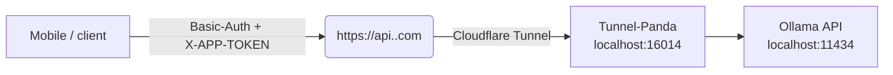

# 🐼 Tunnel Panda – “Panda lives on 16014”

A tiny Node reverse‑proxy that listens on **localhost:16014** and exposes your
local **Ollama API** to the public **through your own Cloudflare Tunnel** –
**only** after the caller passes your **Basic Auth** credentials.

> **Flow**
> ```
> mobile / client
>     │  (Basic‑Auth)
>     ▼
>  https://api.your‑domain.com  ← public Cloudflare tunnel
>     │
>     ▼
>  Tunnel Panda  (localhost:16014)
>     │
>     ▼
>  Ollama  (localhost:11434 or wherever)
> ```

---

## 0 . Prerequisites

| Need                                   | Why                                                |
|----------------------------------------|----------------------------------------------------|
| Cloudflare account + your own domain   | You’ll create the tunnel on a real hostname        |
| `cloudflared` installed on the server  | The lightweight Cloudflare Tunnel daemon           |
| Node 18 + & npm                        | To run Tunnel Panda                                |
| Ollama up and listening locally        | `curl http://localhost:11434` should answer        |

---

## 1 . Clone & configure

```bash
git clone https://github.com/hidim/tunnelpanda.git
cd tunnelpanda
cp .env.example .env          # then open .env and fill the blanks
npm install
```


Developed by a 🐼
# 🐼 Tunnel Panda — “Panda lives on 16014”

Tunnel Panda is a **tiny Node reverse‑proxy** that listens on **localhost:16014** and safely exposes your local **Ollama API** to the public **through *your own* Cloudflare Tunnel**.  
Every incoming request must pass **Basic Auth** (user‑defined) **plus** a static `X‑APP‑TOKEN` before it is forwarded to Ollama.  
Nothing leaves your machine until those gates are cleared.

```

```markdown

---

## 📂 Folder layout

```
tunnelpanda/
├── cloudflared/           # Cloudflare Tunnel config lives here
│   └── config.yml
├── src/                   # Source code
│   ├── app.js             # Tunnel Panda proxy (port 16014)
│   └── config.js          # Loads env variables
├── .env.example           # Copy → .env and edit
└── ReadMe.md              # You are here
```

---

## 0 . Prerequisites

| Need                                           | Why                                                     |
|------------------------------------------------|---------------------------------------------------------|
| **Cloudflare** account + your own domain       | The tunnel needs a public hostname you control         |
| `cloudflared` binary on the server             | Cloudflare Tunnel daemon                                |
| Node 18 + and npm                              | Runs Tunnel Panda                                       |
| **Ollama** running locally (`:11434`)          | The target LLM API                                      |

---

## 1 . Clone & install

```bash
git clone https://github.com/hidim/tunnelpanda.git
cd tunnelpanda
cp .env.example .env          # open .env in your editor and fill the blanks
npm install
```

### Required `.env` vars

```dotenv
# Core
PORT=16014
BASIC_AUTH_USER=panda
BASIC_AUTH_PASS=bamboo
APP_TOKEN=super‑secret‑token

# Ollama
OLLAMA_API_URL=http://localhost:11434
OLLAMA_API_KEY=                 # leave empty if Ollama is open
```

---

## 2 . Create the Cloudflare Tunnel

```bash
cloudflared tunnel login              # one‑time browser auth
cloudflared tunnel create tunnelpanda   # outputs TUNNEL_UUID
cloudflared tunnel route dns tunnelpanda api.your-domain.com
```

---

## 3 . Write `cloudflared/config.yml`

```yaml
tunnel: <TUNNEL_UUID>
credentials-file: /home/<user>/.cloudflared/<TUNNEL_UUID>.json

ingress:
  - hostname: api.your-domain.com
    service: http://localhost:16014
  - service: http_status:404   # anything else → 404
```

*(Store this file at `tunnelpanda/cloudflared/config.yml`)*

---

## 4 . (Optional) Extra Cloudflare Access gate

If you want Cloudflare to demand **another** credential *before* requests reach Panda:

1. Dashboard → **Access › Applications › +Add › Self‑hosted**  
2. Domain = `api.your-domain.com`  
3. Policy → **Service Auth** → *Add Service Token* → note the `CLIENT_ID` + `CLIENT_SECRET`  
4. Clients must now send a second `Authorization: Basic <base64(CLIENT_ID:CLIENT_SECRET)>` header.

Skip if Panda’s own Basic Auth is enough.

---

## 5 . Run everything

```bash
# ❶ Cloudflare Tunnel (foreground)
cloudflared tunnel --config cloudflared/config.yml run tunnelpanda

# ❷ Tunnel Panda (new shell)
npm start
```

---

## 6 . Try it

```bash
curl -u panda:bamboo \
     -H "X-APP-TOKEN: super‑secret‑token" \
     -H "Content-Type: application/json" \
     https://api.your-domain.com/v1/chat/completions \
     -d '{"model":"gemma:7b","messages":[{"role":"user","content":"Hi Panda"}]}'
```

Streaming works too: set `"stream": true`.

---

## 7 . Run as a systemd service (Linux)

`/etc/systemd/system/tunnelpanda.service`

```ini
[Unit]
Description=🐼 Tunnel Panda Proxy
After=network.target

[Service]
WorkingDirectory=/opt/tunnelpanda
ExecStart=/usr/bin/node src/app.js
EnvironmentFile=/opt/tunnelpanda/.env
Restart=always
RestartSec=5

[Install]
WantedBy=multi-user.target
```

```bash
sudo systemctl daemon-reload
sudo systemctl enable --now tunnelpanda
```

---

## 🔒 Security checklist

1. **HTTPS only** — Cloudflare handles TLS for you.  
2. Rotate `BASIC_AUTH_PASS` regularly.  
3. Keep `APP_TOKEN` in secure storage on the mobile app (Keychain / Keystore).  
4. Tweak rate‑limits in `src/app.js` (default 200 req/min/IP).  
5. Monitor Cloudflare Tunnel logs (`--metrics`) for abuse.

---

## License

MIT — Built with ☕, bamboo and Pandas.